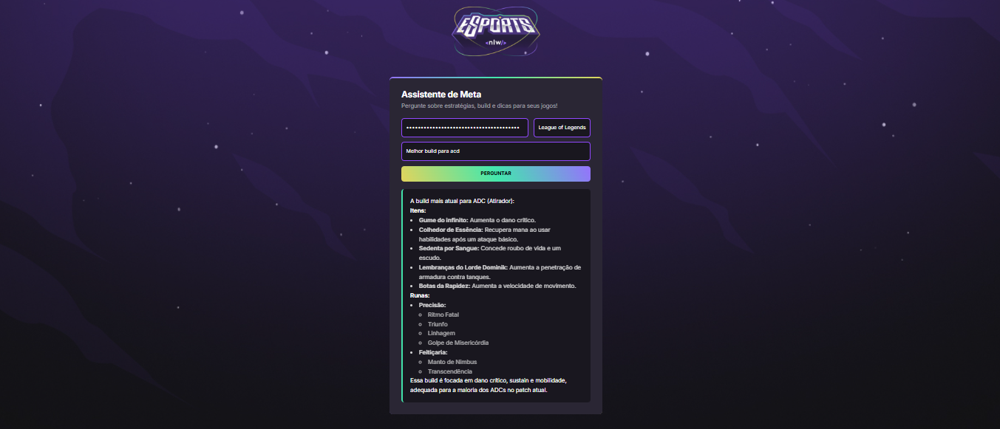

# Game AI Assistant

This is a web project that uses the Gemini AI API to answer user questions about different games.

## Features

- Ask questions related to specific games
- Uses Google Gemini model
- Markdown response formatting

   

   

## How to Use

1. Enter your Gemini API key
2. Choose a game from the list
3. Ask a question
4. See the AI response in markdown format

> Make sure you have a valid API Key from: https://aistudio.google.com/app/apikey

## Technologies

- HTML
- CSS
- JavaScript (Fetch API)
- [Showdown.js](https://github.com/showdownjs/showdown) for Markdown parsing

## Note

**Project developed during Rocketseat NLW event.**
